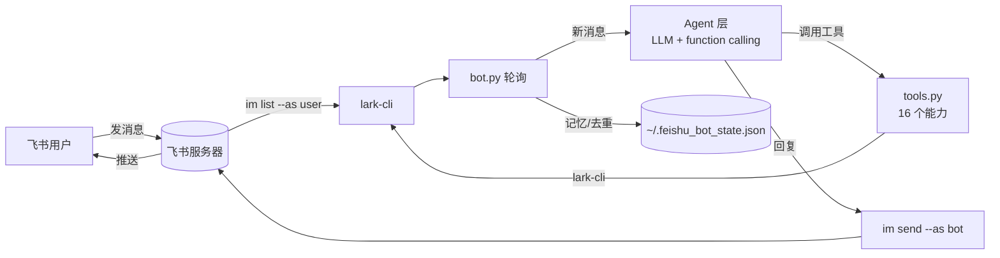

# feishu-cli-bot

> 一个**本地常驻**的飞书 AI 助手：无需开放平台后台、无需公网服务器、无需 App Secret，
> 复用你本机已授权的 `lark-cli`，配合任意 OpenAI 兼容大模型，实现真正的「在飞书里对话、让 AI 真的去干活」。

[](https://www.python.org/)
[](LICENSE)
[](requirements.txt)

---

## ✨ 为什么它不一样

普通飞书机器人要自建应用、配回调、审 scope、搭公网服务——对个人开发者极其劝退。
本项目换了一条路：**你机器上已经授权的 `lark-cli` 就是最好的飞书 SDK**。

- 🔓 **零后台配置** —— 不建应用、不配事件订阅、不审权限，跑起来就行
- 💬 **双向对话** —— 用「用户身份读消息、机器人身份发消息」的双身份模式，让飞书里的对话真正闭环
- 🧠 **真·Agent** —— 大模型通过 function calling 自主调用 16 个工具，**能查日程、建任务、读文档、扫全天对话**，而不是只会聊天
- 🗂️ **今日活动总览** —— 一句话「我今天发了什么 / 我的飞书活动」，自动汇总你发出的消息、全天对话、日程与任务
- 🔌 **任意大模型** —— OpenAI / 火山方舟豆包 / 本地 Ollama 等任意 OpenAI 兼容接口
- 🔒 **写操作安全闸** —— `FEISHU_BOT_ALLOW_WRITE=0` 一键切只读，只看不写
- 🚀 **开机自启** —— 注册为 macOS 登录项，后台常驻，关掉终端窗口照常运行
- 📦 **零第三方依赖** —— 仅用 Python 标准库，拿台干净机器就能跑

## 🧩 架构



> 详见 [docs/ARCHITECTURE.md](docs/ARCHITECTURE.md)，双身份模式与数据流在那里有逐步拆解。

## 🚀 快速开始

### 1. 安装

```bash
git clone https://github.com/cangyuyi/feishu-cli-bot.git
cd feishu-cli-bot
# 可选：可编辑安装（提供 feishu-bot 命令）
python3 -m pip install -e .
```

或直接使用（零安装）：

```bash
python3 -m feishu_bot --selftest
```

### 2. 授权飞书

```bash
lark-cli auth login --domain calendar
```

按提示完成设备码授权（浏览器里登录你的飞书账号）。需要 `im`（消息）、`calendar`（日历）、`task`（任务） 等 scope；
如果只想「看活动和出日报」，授权 `im + calendar + task` 即可。

> 没有 `lark-cli`？它通常随飞书类宿主应用（如 WorkBuddy）的 CLI 连接包提供，确保它在 `PATH` 中即可。

### 3. 写配置

```bash
cp config/feishu_bot_env.example ~/.feishu_bot_env
chmod 600 ~/.feishu_bot_env
# 编辑 ~/.feishu_bot_env，填入 LLM base_url / key，以及监听的 chat_id
```

| 配置项 | 必填 | 说明 |
|--------|------|------|
| `FEISHU_BOT_LLM_BASE_URL` | ✅ | 大模型接口地址（自动补 `/chat/completions`） |
| `FEISHU_BOT_LLM_KEY` | ✅ | API Key |
| `FEISHU_BOT_LLM_MODEL` | ✅ | 模型名，如 `doubao-seed-2-1-pro-260628` |
| `FEISHU_BOT_CHAT_ID` | ⚠️ | 监听的私聊 `chat_id`；不设则走代码默认值 |
| `FEISHU_BOT_INTERVAL` | ❌ | 轮询间隔秒数，默认 `3` |
| `FEISHU_BOT_ALLOW_WRITE` | ❌ | `1` 允许写 / `0` 只读，默认 `1` |
| `FEISHU_BOT_TYPING` | ❌ | `1` 收到消息回「正在输入」表情，默认 `1` |

### 4. 跑起来

```bash
# 自检：环境 / 授权 / 工具连通性
python3 -m feishu_bot --selftest

# 前台常驻（Ctrl+C 退出）
python3 -m feishu_bot

# 只跑一轮（调试用）
python3 -m feishu_bot --once
```

打开飞书，在对应会话里发一句「我的飞书活动」，机器人就会调用 `get_my_activity` 给你汇总。

## 🛠️ 工具清单

机器人内置 **16 个**可被大模型自主调用的能力，涵盖日程、任务、通信、文档、云盘、活动总览与日报：

| 分类 | 工具 |
|------|------|
| 日程/任务 | `get_agenda` `create_event` ✏️ `find_free_time` `get_tasks` `create_task` ✏️ `task_search` |
| 通信 | `list_chats` `search_messages` `send_message` ✏️ `reply_to_message` ✏️ |
| 文档/云盘 | `read_document` `list_drive_files` |
| 信息/报告 | `whoami` `get_daily_chats` `get_my_activity` `generate_report` |

完整参数与说明见 [docs/TOOLS.md](docs/TOOLS.md)。✏️ = 写操作，受 `FEISHU_BOT_ALLOW_WRITE` 控制。

## 🔁 开机自启（macOS）

```bash
# 一键加入登录项（开机自动后台运行）
bash scripts/install.sh
```

或手动双击 `scripts/launch.command`：脚本用 `nohup ... &` + `disown` 把进程放到后台并脱离终端，
关闭窗口不影响运行，日志写到项目根目录 `bot-poller.log`。

```bash
# 查看实时日志
tail -f bot-poller.log
# 检查进程
ps aux | grep "python3 -m feishu_bot" | grep -v grep
```

## 📁 项目结构

```
feishu-cli-bot/
├── src/feishu_bot/        # 包源码（仅标准库）
│   ├── cli.py             # lark-cli 封装层
│   ├── config.py          # 配置加载
│   ├── storage.py         # 记忆/去重持久化
│   ├── formatter.py       # 纯函数：内容解析/时间格式化
│   ├── tools.py           # 16 个工具实现 + 注册表
│   ├── schemas.py         # function calling 工具声明
│   ├── agent.py           # 大模型调用 + 多轮 function calling
│   ├── bot.py             # 主轮询循环 + CLI 入口
│   ├── __init__.py
│   └── __main__.py
├── scripts/               # launch.command（自启）/ install.sh（安装）
├── config/                # feishu_bot_env.example 配置模板
├── tests/                 # 单元测试（标准库 unittest，零依赖）
├── docs/                  # ARCHITECTURE.md / TOOLS.md
├── .github/workflows/     # CI
├── pyproject.toml
├── Makefile
├── requirements.txt
└── README.md
```

## 🧪 开发

```bash
make test        # 运行单元测试（unittest，无需第三方依赖）
make lint        # 语法检查（py_compile）
make selftest    # 运行环境自检
make run         # 前台运行
```

测试覆盖纯函数（解析/格式化）、配置加载、写开关，以及**工具注册表与 schema 的一致性**（保证 16 对 16 不错位）。

## ❓ 常见问题

**Q：为什么读消息要用 `--as user`、发消息用 `--as bot`？**
A：以用户身份才能看到别人发给你的消息；以机器人身份发送则绕过了开放平台后台的回调配置。两者都依赖 `lark-cli` 本地已授权的 token。详见 [ARCHITECTURE.md](docs/ARCHITECTURE.md)。

**Q：token 会过期吗？**
A：会。过期后机器人读不到消息，重新跑一次 `lark-cli auth login --domain calendar` 即可。

**Q：能换大模型吗？**
A：能。任意 OpenAI 兼容接口（base_url + key + model）都可以，改 `~/.feishu_bot_env` 即可，无需改代码。

**Q：没配大模型能用吗？**
A：能。未配置时退化为「关键词工具 + 规则回复」模式，仍可用「日程/待办/日报/我是谁」等指令。

## 🔒 安全说明

- 配置文件 `~/.feishu_bot_env` 含 API Key，**已被 `.gitignore` 忽略，且建议权限 `600`**。
- 写操作默认开启，但每个写工具都有安全闸；只用来看活动时可设 `FEISHU_BOT_ALLOW_WRITE=0`。
- 机器人完全运行在你本机，消息不外发到任何第三方服务（除了你配置的大模型接口）。

## 📄 许可证

[MIT](LICENSE) © feishu-cli-bot contributors

---

> 本项目已开源发布于 [github.com/cangyuyi/feishu-cli-bot](https://github.com/cangyuyi/feishu-cli-bot)，采用 MIT 许可证，欢迎 Star / Fork / 提 Issue。
