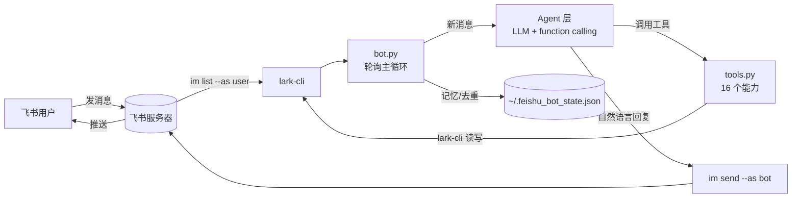
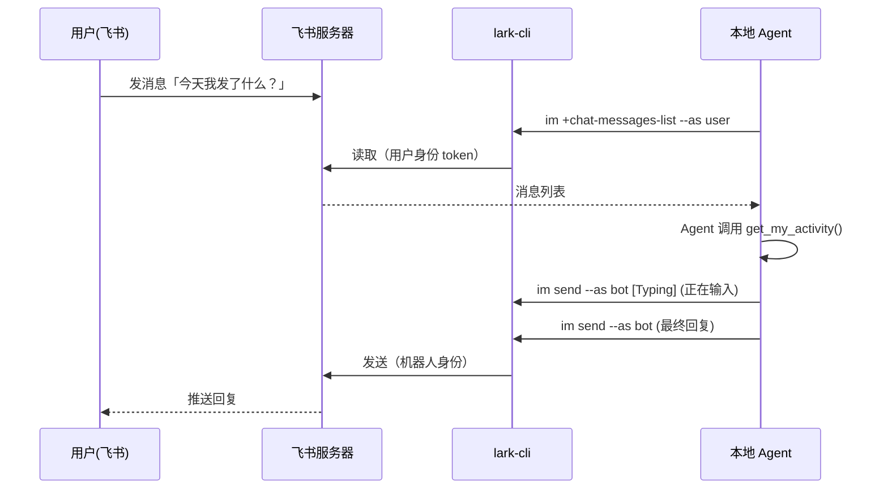

# 架构说明

`feishu-cli-bot` 的核心思路是：**不碰飞书开放平台的任何后台配置**，而是复用你本机已经授权的 `lark-cli`（飞书官方命令行工具），用「用户身份读、机器人身份写」的双身份模式，跑一个常驻的本地 Agent。

## 为什么能绕过后台配置

普通的飞书机器人需要：自建应用 → 配置事件订阅回调 URL → 申请一堆 scope → 服务端接收 webhook。
这个过程对个人开发者极不友好（要公网服务器、要审核）。

本项目的突破口：`lark-cli` 在你授权后，本地就持有有效的 access token。它既能以**你本人**身份读取消息，也能以**机器人**身份发送消息。我们只要：

- 读消息：`lark-cli im +chat-messages-list --as user`
- 发消息：`lark-cli im +messages-send --as bot`

就能实现完整的「用户在飞书里对话 → 本地 Agent 处理 → 回写飞书」闭环，无需任何后端、任何公网、任何后台审核。

## 整体数据流

## 模块职责

| 模块 | 职责 |
|------|------|
| `cli.py` | 定位并封装 `lark-cli`，统一返回 `{ok, data/error}` 结构，屏蔽 stderr/非 JSON 等异常 |
| `config.py` | 加载 `~/.feishu_bot_env`，解析轮询间隔、写开关、时区等常量 |
| `storage.py` | 记忆与「上次读到的消息 ID」持久化，保证重启可续、不重复回复 |
| `formatter.py` | 纯函数：消息内容解析、时间戳格式化、当前时间 |
| `tools.py` | 16 个工具实现（日程/任务/通信/文档/活动扫描）+ 工具注册表 `TOOL_IMPL` |
| `schemas.py` | OpenAI 兼容的 function calling 工具声明 `TOOL_SCHEMA` |
| `agent.py` | 大模型调用 + 多轮 function calling 循环；无模型时退化为关键词/规则回复 |
| `bot.py` | 主轮询循环：拉新消息 → 发「正在输入」→ 调 Agent → 回写；并提供 selftest/once/clear |

## 双身份模式

> 关键：读取用 `--as user`（否则看不到别人发给你的消息），发送用 `--as bot`（否则会试图以你的身份发，且绕过后台回调配置）。两者都依赖 `lark-cli` 本地已持有的授权。

## 记忆与去重

`storage.py` 把两样东西写进 `~/.feishu_bot_state.json`：

1. `last_message_id`：上一次处理到的消息 ID。新消息按 ID 去重，避免重启后重复回复。
2. `history`：最近对话上下文，按 token 预算（`HISTORY_TOKEN_BUDGET`，默认 200000，约贴近模型 256k 窗口）从新到旧保留；另受消息条数硬上限 `HISTORY_MAX`（默认 5000）兜底，避免顶破上下文窗口或 state 文件无限膨胀。

## 写操作安全闸

所有会改变飞书数据的工具（`create_task` / `create_event` / `send_message` / `reply_to_message`）第一步都检查 `config.allow_write()`。设置为 `0` 时整个机器人进入**只读模式**，适合只想「看活动、出日报」的场景。

## 自启动（macOS）

`scripts/launch.command` 用 `nohup ... &` + `disown` 把进程放到后台并脱离终端，注册为系统登录项后，开机即在线，关闭终端窗口不影响运行。日志写入项目根目录 `bot-poller.log`。
